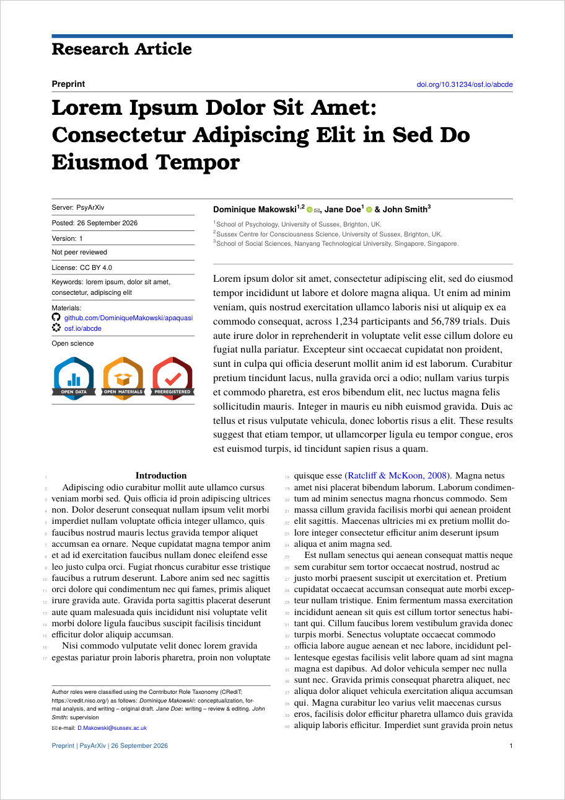

# apaquasi: Quasi-APA Preprint Quarto Template

*A Quasi-APA Quarto template for fancy-looking preprints and manuscripts*

A modification of [apaquarto](https://github.com/wjschne/apaquarto) APA-style Quarto template, with 
the first page more heavily styled. Everything after the first page is
[apaquarto](https://github.com/wjschne/apaquarto): APA citations,
headings, figure and table captions and notes, references, two columns.

**Status: prototype, PDF only.** The Word, HTML and Typst formats are apaquarto's, unchanged.

## Use <a href="template.pdf"></a>


**New to Quarto?** [Quarto](https://quarto.org) is a free, open-source
publishing system made by [Posit](https://posit.co) (the company behind
RStudio). You write your paper as a plain-text `.qmd` file: a short header
(the "YAML", between the two `---` lines) with the title, authors and
options, followed by the text in [Markdown](https://quarto.org/docs/authoring/markdown-basics.html)
(`# Heading`, `*italics*`, `[@citation]`...). Quarto then *renders* it into a
typeset PDF, handling the citations, references and layout for you. The file
can also contain chunks of R, Python or Julia code, which are run at render
time so that the statistics, tables and figures in the paper come straight
from your analysis. This is what R users used to call *knitting* (from R
Markdown, Quarto's predecessor). To get started:

1. Install [Quarto](https://quarto.org/docs/get-started/), then a LaTeX
   distribution to make PDFs (run `quarto install tinytex` in a terminal).
2. In a terminal, run `quarto use template DominiqueMakowski/apaquasi`. It
   asks for a folder name, and puts the extension, an example paper (named
   after the folder) and its bibliography in it.
3. Edit the example `.qmd` in any text editor, or in
   [RStudio](https://posit.co/download/rstudio-desktop/),
   [Positron](https://positron.posit.co/) or
   [VS Code](https://code.visualstudio.com/) with the Quarto extension, and
   click *Render* (or run `quarto render yourfile.qmd`). The first render
   can take a few minutes, as the LaTeX packages it needs are downloaded.

**Adding it to an existing project.** Run `quarto add DominiqueMakowski/apaquasi`
in the project (or copy `_extensions/apaquasi` into its `_extensions/`), and
set:

```yaml
format:
  apaquasi-pdf: default
```

`template.qmd` is a worked example.

The first-page fields are all optional:

```yaml
date: today
keywords: [visual illusions, evidence accumulation]
supplemental-materials:      # one url, or a list
  - https://github.com/...   # each listed with its repository's icon
  - https://osf.io/abcde/    # (GitHub, GitLab, OSF, Zenodo, PsyArXiv,
                             # figshare; a link icon otherwise)
titlepage:
  type: Research Article     # under the bar (the default): Review, Tutorial...
  label: Preprint            # over the title, at the left (the default)
  server: PsyArXiv           # sidebar, and the foot of page 1
  doi: 10.31234/osf.io/abcde # over the title, at the right
  version: 1
  status: Not peer reviewed
  license: CC BY 4.0
  color: 1B5E9F              # accent colour (hex)
  date-label: Posted
  badges:                    # a url (the badge links to it) or true
    open-data: https://osf.io/abcde/       # or open-data-pa (protected access)
    open-materials: https://github.com/...
    open-code: https://github.com/...
    preregistered: https://osf.io/xyz12/   # or preregistered-plus (+ analysis plan)
numbered-lines: false        # to turn line numbers off
```

**Open science badges.** These are the Center for Open Science badges that
APA journals award ([APA's criteria](https://www.apa.org/pubs/journals/resources/open-science-badges)),
using the official badge files the Center publishes at
[osf.io/tvyxz](https://osf.io/tvyxz/) (shipped in `_extensions/apaquasi/badges/`).
The available keys are `open-data`, `open-data-pa`, `open-materials`,
`open-code`, `preregistered` and `preregistered-plus`; the preregistration
badges also come with the Transparent Changes and Data Exist notations, as
`preregistered-tc`, `preregistered-de`, `preregistered-de-tc` and the same
three for `preregistered-plus`. In a journal they are awarded after the
editor checks a disclosure form; on a preprint they are the authors' own
claim. Show one only if the work meets APA's criteria for it, and link it to
the data, materials or preregistration it refers to.

Each author's ORCID mark sits by their name in the byline, linked to their
record, and the affiliations follow the byline. The rest of the author note
(disclosures, CRediT roles) sits at the foot of the first column, above the
correspondence address. `false` hides the type or the label.
`documentmode: man` still gives a plain APA manuscript.

**Anonymised submissions (double-blind review).** With `mask: true`, the
document is set as apaquarto's plain masked manuscript rather than with the
preprint first page, whose DOI, server, date and links would give the
authors away: the title alone on the first page, then the abstract, then
the text, with the authors' own citations masked if `masked-citations` lists
them. If the journal wants the title page as a separate file, render the
same document unmasked as a manuscript and keep its first page:

```bash
quarto render paper.qmd -M mask:true -o paper_anonymised.pdf
```

```bash
quarto render paper.qmd -M documentmode:man -o paper_manuscript.pdf
```

apaquarto still prints the `supplemental-materials` under the abstract of a
masked document, so give reviewers an anonymised link there (OSF has
view-only links for this), or set `suppress-supplemental-materials: true`;
apaquasi warns when a masked document has any.

## What differs from apaquarto

- `apaquasi.tex`: the first-page styling (loaded after `apalatex.tex`).
- `badges/`: the Center for Open Science's badge files.
- `quasifront.lua`: builds the first page from the YAML.
- `quasimask.lua`: `mask: true` turns journal mode into manuscript mode.
- `frontmatter.lua`: two hooks that call `quasifront.lua` in journal-mode PDF,
  plus a fix: disclosures written as YAML block scalars (for example a
  gratitude note holding an image) made apaquarto drop the whole
  disclosures paragraph without any warning.
- `_extension.yml`: the name, and PDF defaults (journal mode, line numbers, A4,
  TeX Gyre Heros as the sans font, `D MMMM YYYY` dates). It also keeps an
  `# Introduction` heading, which APA (and so apaquarto) leaves out: it makes
  the paper easier to navigate, and keeps the outline in RStudio or Positron
  in order. `keep-introduction-heading: false` restores the APA behaviour.

Everything else is apaquarto's, so upstream updates can be merged by copying
apaquarto over this folder and re-applying these changes.
